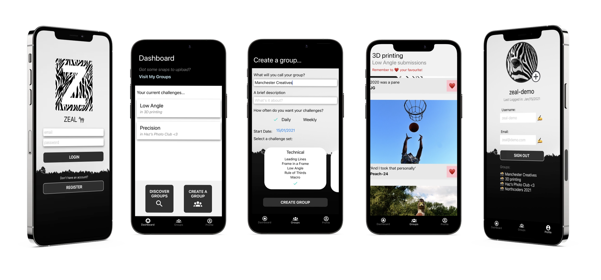

# Zeal 🦓

Zeal is a social activity app that allows friends to get creative and collectively partake in regular photography challenges on different topics, wherever they are. 

Each user-created group, has a list of challenges to work through, which include topics like portraits, nature, black and white, and more. After submitting that challenge's entry, a user can then see how their friends fared and vote for their favourite. 

## Visuals:

## Tech Used:

React Native | JavaScript | Redux | Firebase Firestore | Firebase Authentication | Google Cloud Storage | Expo

## How to deploy:

You can interact with the app on either a iOS simulator or an android simulator if you have those downloaded.

You can also use the Expo app on your mobile to scan a QR code, and then use the app on your own phone.

Steps:

1. Fork and git clone this repo onto your own computer.
2. Using terminal, `cd zeal_app` to get into the repo.
3. Run `npm install` to install the dependencies.
4. After the above is complete, run `expo start -c` and wait for the QR code to appear.
5. Either scan the QR code with your phone (which should open the Expo app) or type the appropriate letter in terminal to open a simulator.

**Notes**

- We're currently looking at improving responsiveness across devices. Because of this, the recommended way of viewing the app is using xcode's iOS simulator, on an iPhone 12 pro model.
